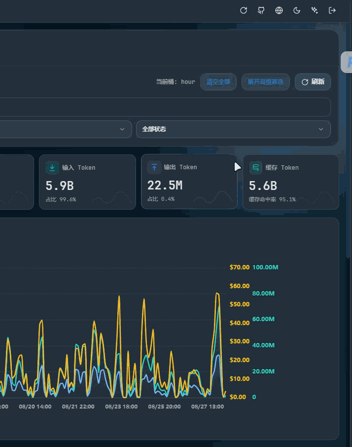

<div align="center">

# CPAMP Theme Studio

[](https://github.com/Cec1c/cpamp-theme-studio/releases/latest)
[](https://github.com/Cec1c/cpamp-theme-studio/actions/workflows/ci.yml)
[](https://github.com/router-for-me/CLIProxyAPI)
[](https://github.com/seakee/CPA-Manager-Plus)
[](LICENSE)

通过 CPA/CPAMP 插件市场交付的主题扩展。无需维护面板 fork，即可为 CPA Manager Plus 增加持久化、多语言的可视化主题工作室。

[English](README.md) ｜ [快速安装](#快速安装) ｜ [Linux bootstrap](docs/BOOTSTRAP.zh-CN.md) ｜ [完整部署文档](docs/DEPLOYMENT.zh-CN.md)

</div>

## 主题工作室能做什么？

- **随时改变面板观感。** 内置 CPAMP 蓝与九套独立配色，支持自定义强调色、明暗模式、字体、圆角、密度、布局和视觉效果。
- **直接复用原生主题入口。** 点击面板右上角原有“主题”控件即可打开工作室，不生成重复的悬浮按钮或侧栏菜单。
- **让偏好稳定保留。** 所有设置即时预览并保存在浏览器本地，支持旧偏好迁移与一键重置。
- **经得起面板更新。** 上游覆盖 `management.html` 后，插件 watcher 会重新注入唯一 loader；停用时只清理自己的标记块。
- **安全完成 Linux 更新。** 一次 bootstrap 后，市场安装、升级和手动“重新启动”都能自动重启 CPA、验收新版本，并在失败时回滚。

## 功能演示

<table>
  <tr>
    <td align="center">
      <strong>主题换色与即时预览</strong><br>
      
    </td>
  </tr>
</table>

## 快速安装

### Linux + systemd（推荐）

先执行一次管理员核对过的 bootstrap，再从 CPAMP 插件市场安装。bootstrap 不是主题功能的运行依赖；它负责准备路径、安装安全重启链和提供失败回滚。未安装 bootstrap 时也能使用插件，但每次安装或升级后要手工重启 CPA。

固定当前 Release、校验脚本，然后先 dry-run：

```bash
version=0.2.2
base="https://github.com/Cec1c/cpamp-theme-studio/releases/download/v${version}"

curl -fLO "${base}/bootstrap-linux.sh"
curl -fLO "${base}/checksums.txt"
grep ' bootstrap-linux.sh$' checksums.txt | sha256sum -c -
chmod 0755 bootstrap-linux.sh

./bootstrap-linux.sh \
  --bootstrap-version "${version}" \
  --panel-url https://example.com/management.html
```

核对输出中的 CPA unit、有效配置、插件目录和活动面板。确认无误后，用同一组参数执行：

```bash
sudo ./bootstrap-linux.sh \
  --bootstrap-version "${version}" \
  --apply \
  --panel-url https://example.com/management.html
```

如果自动发现存在多个候选，请按 dry-run 提示显式补充 `--service`、`--config` 和 `--panel-path`。Manager Server 部署必须提供准确的公网 `--panel-url`；CPA 原版轻量面板也强烈建议提供，以证明本地文件就是实际访问的页面。

完成 bootstrap 后：

1. 打开 CPAMP 的“插件”→“插件商店”。
2. 搜索 `CPAMP Theme Studio`，选择 Latest 并安装。
3. 等待 CPA 自动重启，回到仪表盘，点击右上角原有“主题”控件。

bootstrap 已经把本项目社区源合并进 CPA 的有效配置，因此不需要再手工添加商店地址。

### Windows、macOS 或非 systemd 环境

把社区源加入 CPA 的有效 `config.yaml`：

```yaml
plugins:
  enabled: true
  dir: "/absolute/path/to/cpa/plugins"
  store-sources:
    - "https://raw.githubusercontent.com/Cec1c/cpamp-theme-studio/main/registry.json"
```

然后在插件市场安装，并手工重启实际承载面板的 CPA 进程或服务。`dir` 建议使用绝对路径；如果 CPA 访问 GitHub 需要代理，应把代理变量配置到 CPA 服务自身的运行环境。

## 市场、bootstrap 与 broker

| 组件 | 实际职责 |
| --- | --- |
| CPAMP/CPA 插件市场 | 下载清单固定的平台 ZIP、校验 SHA-256、把版本化动态库写入插件目录，并更新 `store.version` |
| `bootstrap-linux.sh` | 下载并校验 Release，但只提取和运行 bootstrap 程序；它不会把 Theme Studio `.so` 当作插件安装 |
| bootstrap `--apply` | 备份配置和面板，合并插件目录/商店源/面板路径，安装 root 持有的 systemd broker，绑定唯一 CPA unit，然后重启并验证 |
| broker | 监听市场写入或重启请求，等待文件稳定，只重启已绑定的 CPA，验证 PID、服务、资源版本和真实面板；失败时恢复上一个 accepted 版本 |
| Theme Studio 插件 | 提供浏览器资源并维护 `management.html` 中的 loader 标记，不读取模型凭据，也不参与 Provider 或请求转发 |

broker 不是网络代理，也不会“爬取”插件。它是一条权限受限的 root 执行链：浏览器和插件只能创建一个小型请求文件，不能传入任意服务名，也不能直接调用 `systemctl`。

技术上可以让 bootstrap 顺便解出 `.so`，但这会绕过 CPA 市场的版本配置、平台选择、校验和 UI 状态，形成第二套安装器。当前设计刻意让市场负责安装，让 broker 只负责安装后的重启、验收和回滚；因此 bootstrap 只需执行一次，后续市场更新不需要重新运行脚本。

## 面板支持

| 部署模式 | 支持情况 | 要求 |
| --- | --- | --- |
| CPA `:8317` 托管的原版 CPAMP 轻量面板 | **直接支持** | CPA 能写入实际 `static/management.html` |
| 使用外置 `PANEL_PATH` 的 CPAMP Manager Server | **有条件支持** | CPA 与 Manager Server 共享同一个可写文件，并向 bootstrap 提供准确的公网 `--panel-url` |
| 只有内嵌面板的 Manager Server | **Linux bootstrap 可外置** | 直接部署在 Linux/systemd，并提供活动公网 `--panel-url` |

CPA 原版轻量面板是最简单、支持最直接的模式。`panel_path` 留空时，插件只接受唯一且无冲突的显式环境路径，或 CPA 工作目录、可执行文件、配置文件附近唯一存在的 `static/management.html`；存在多个候选时会停止，不会猜测。

插件本身不能修改另一个 Manager Server 进程里的内嵌页面。Linux bootstrap 可以把活动面板下载为外置 `PANEL_PATH`，让 CPA 和 Manager Server 绑定同一个文件，再验证公网页面。

## 兼容基线

| 组件 | 已验证版本 | 状态 |
| --- | --- | --- |
| CLIProxyAPI / CPA | v7.2.138 | ABI、注册、资源路由、热重载和停用生命周期已验证 |
| CPA Manager Plus / CPAMP | v1.12.2 | 官方 `management.html` 注入和真实浏览器行为已验证 |
| Windows | amd64 | DLL 真实加载和浏览器测试通过 |
| Linux | amd64 | `.so` 真实加载、资源、注入、bootstrap 与失败回滚通过 |
| Linux | arm64 | 原生 Release 构建目标；生产使用前应复核发布工作流 |
| macOS | amd64、arm64 | 原生 CI/Release 构建目标 |
| Windows | arm64 | 原生 Release 构建目标；生产使用前应复核发布工作流 |

未来版本只要 CPA 插件 ABI 与 CPAMP 单文件面板结构保持兼容，通常可以继续工作；生产升级前仍应按部署文档重新验证。

## 工作原理

1. CPA 通过 plugin ABI v1 加载最小原生桥。
2. 原生桥注册一个隐藏、只读的 loader/字体资源路由，不发布 CPAMP 侧栏菜单。
3. 注入器在可信、可写的 `management.html` 中插入唯一 start/end 标记块。
4. loader 在 Shadow DOM 中挂载主题工作室，通过 CPAMP CSS 变量和兼容的本地主题存储应用偏好。
5. watcher 在面板被覆盖后恢复 loader；热停用时确定性移除标记。

插件不会拦截 CPA 请求、读取或代理凭据、暴露任意文件，也不会发布未认证的重启接口。

## 开发与验证

需要 Go 1.26+、原生 CGO 编译器；可选 Node.js 24+ 用于检查 loader 语法。

```bash
go test ./...
go vet ./...
node --check assets/loader.js
```

Windows 打包：

```powershell
.\scripts\build.ps1 -Version 0.2.2-dev
.\scripts\package.ps1 -Version 0.2.2-dev
```

Linux/macOS 打包：

```bash
./scripts/build.sh 0.2.2-dev
./scripts/package.sh 0.2.2-dev
```

## 文档

| 文档 | 内容 |
| --- | --- |
| [Linux bootstrap](docs/BOOTSTRAP.zh-CN.md) | dry-run、apply、broker、验收、诊断和回滚 |
| [部署文档](docs/DEPLOYMENT.zh-CN.md) | 市场安装、面板模式、升级、回退和卸载 |
| [Agent 部署手册](docs/AGENT_DEPLOYMENT.md) | 自动化部署的安全边界和逐项检查清单 |
| [v0.2.0 发布说明](docs/RELEASE_NOTES_v0.2.0.md) | 事务化 Linux 更新链的设计背景 |
| [安全策略](SECURITY.md) | 漏洞报告与安全说明 |

## 许可与来源

[MIT](LICENSE)。CPA ABI、CPAMP 原型、YAML 依赖、JetBrains Mono 许可与配色来源见 [THIRD_PARTY_NOTICES.md](THIRD_PARTY_NOTICES.md)。本项目不分发 CPAMP 的 `management.html`，也不包含 AGPL `new-api` 的代码或资源。
